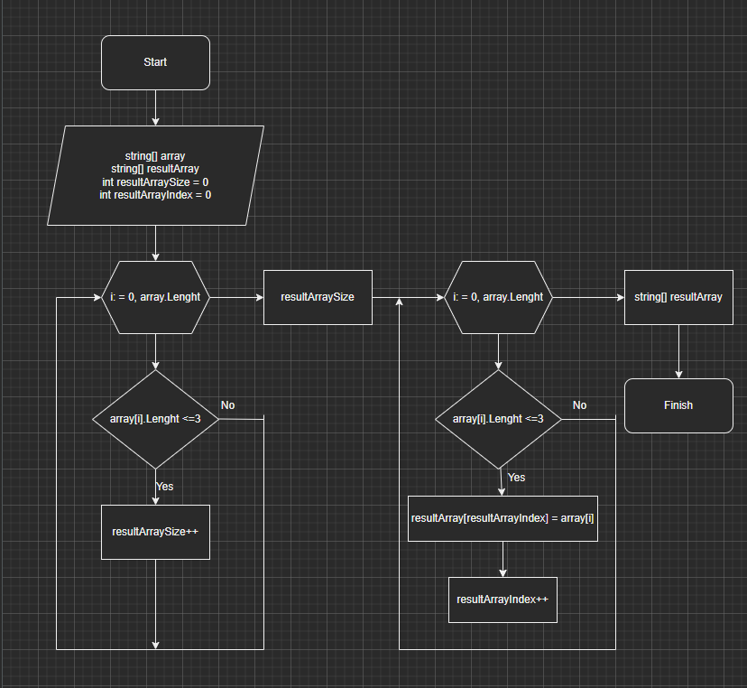

# Итоговая работа по курсу "Выбор специализации".
## **Задача**: Написать программу, которая из имеющегося массива строк формирует массив из строк, длина которых меньше либо равна 3 символа.

### Решение задачи можно разделить на этапы:
1. Объявление исходного массива строк. Я решил задать массив самостоятельно.
2. Написание метода, выводящего массив на экран.
3. Написание основгого метода, который будет формировать новый массив строк с заданными условиями.
* В первую очередь при помощи цикла _**for**_ и условия _**if**_ определяем количество элементов нового массива, чтобы выделить память под новый массив. В переменной **resultArraySize** записываем новое значение, если встречается элемент массива, отвечающий условиям задачи.
* Создаем новый массив с названием **resultArray** и заполняем его в соответствии с условиями задачи. Для этого также используем цикл _**for**_ и условие _**if**_.
* Подробнее с методом можно ознакомится на блок-схеме:

4. Вывод обоих массивов на экран, чтобы убедиться в корректности выполнения задачи.